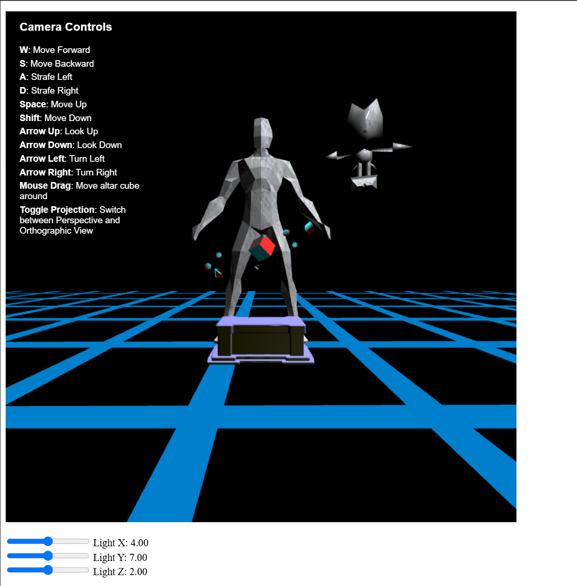
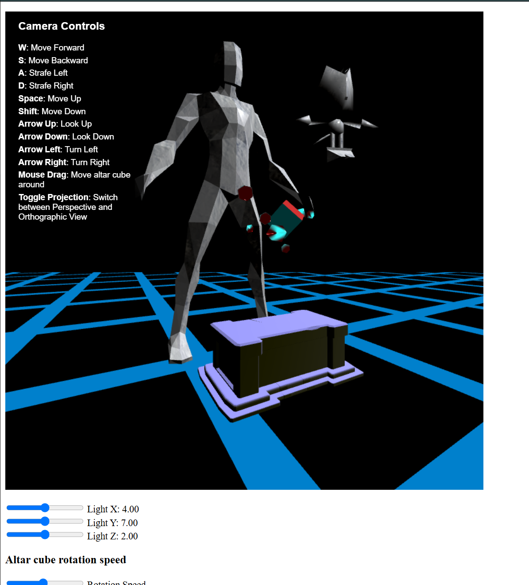
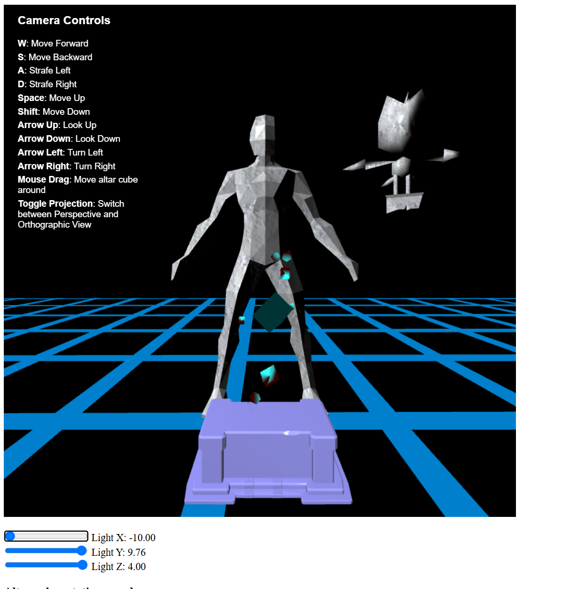

# Project 3: Snow man and snow tails discovering altar of shapes

Name: Anthony Zhang  
netid: QCK6544  
Project title: *Snow man and snow tails discovering altar of shapes*
## Introduction

This graphics showcase a man and tails from sonic the hedgehog that is made of now standing behind an alter of different shapes flying around each other. The shapes include cube, diamonds, icosahedrons. They will fly in unpredictable mot

## Summarization of files
- project3.html, this includes instruction for interactions and basic webpage structure
- project3.js, this include all the webgl code that allows the graphics to be rendered
- diamond_with_normals.obj, this is the obj file for the diamond shape
- icosahedron_with_normal.obj, this is the obj file for the icosahedron shape
- altar.obj, this is the obj file for the altar shape
- man_with_normal.obj, this is the obj file for the man shape
- tails.obj, this is the obj file for the tails shape
- img/, this is the folder for all the screenshots

## Overview on the lighting features

All of the objects in the scene have light casted on it.
For the additional lighting feature, I choose texturing and textured the man and tails with a snow texture.

I have not implemented shadow maps, so the floating shapes assembly is still lit when the light source is behind the man. This creates a "glowing" effect, which is pretty cool in itself.

## Overview of the interaction

### interaction with light
The user can change the location of the light source by sliding the light sliders to change it's x, y, and z values.

### interaction of assembly
There is two assembly in this program: 
- floating shapes on top of the altar.
- the man and tails

The user can click on the cube in the center of the floating shape to move that assembly around the scene.

The rotation speed slider below the canvas also allow the user to define the movement speed of the assembly. Higher speed means faster rotation/movement & vice versa.

### Interaction with the camera

Pressing `w`,`a`,`s`,`d` allows the user to move the camera itself forward, backwards, left and right. 

Pressing the `shift` button moves the camera down, `space` moves the camera up.

Pressing the arrow keys pan and rotate the camera to different angles, and allow the user to view the scene in different angles.

The Near and Far slider allows the user to define bound for the viewing frustum.

The FOVY slider allow the user to change the field of view of the camera.

The Aspect slider allow the user to change the aspect of the camera.

The Toggle button allows the user to toggle between a perspective camera and a Orthographic camera.

